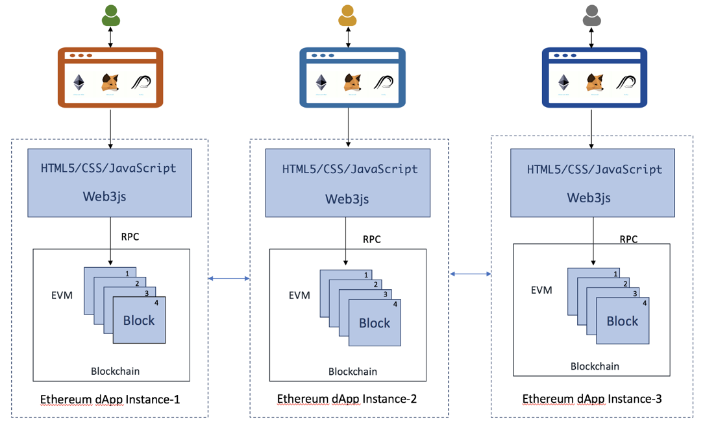

# PervasiveSubject

PervasiveSubject is a single project developed during the Pervasive Systems course at "La Sapienza" University of Rome, implementing a Decentralized application on the Ethereum Local Network

# How does it work?
## DAPP
The decentralized application exploits the peer to peer network, specefically the Ethereum network, in order to implement the businnes logic.
No central data center contains and run the core logic, but each single node of the Ethereum network.
On the other hand, the frontEnd runs on the users' computer.

## Implementation
My first step, but it's not necessary for the DAPP application, was to install an Ethereum node on the Raspberry Pi 3 and run the client in order to connect with the Ethereum network.
[Demo - YouTube](https://youtu.be/YpJMcgcYTns)

The Dapp application is composed by a:
* FrontEnd
* BackEnd

The FrontEnd is written in Javascript and loaded trough a browser.
The backend is written as Smart Contract and deployed on a local simulation of the Ethereum network.

# Project presentation
SlideShare: 
  * [DAPP](https://www.slideshare.net/enricoverzegnassi/ethereum-node-dapp-application-99538968)

# Demo
[Demo - YouTube](https://www.youtube.com/watch?v=tr50gB-retM)

# Goal of this project
The Goal of this project is to let an user vote a subject only once without the possibility to cheating.

# Contact
Linkedin:
 * [Enrico Giulio Maria Verzegnassi](https://www.linkedin.com/in/enrico-verzegnassi/)

